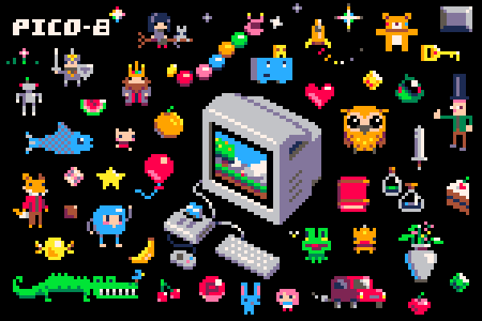

# pico_workshop

### Description
[PICO-8](https://www.lexaloffle.com/pico-8.php) is a virtual console for making and playing retro looking games. We'll spend two weeks writing code, drawing sprites, sequencing music and designing levels to create games on it!

We will be coding in Lua, a simple scripting language that can be picked up fairly quickly by someone who is comfortable with coding.

Dylan Bennet in their [Game Development with PICO-8 Zine](https://mboffin.itch.io/gamedev-with-pico-8-issue1):
> "It's well known that creativity thrives within constraints. Nowhere is that more true than with PICO-8. Limited screen size, color palette, code length, and so on all contribute to an environment where you are actually free to be more creative than you might be with other game engines.
Unity is a great example of a game engine with very few constraints on what you can create. While that's good, it also means you have many decisions to make. PICO-8's constraints do away with many of those decisions and let you focus on just creating your game.
For example, a Unity game might have to work on dozens of screen resolutions, but in PICO-8, you get one resolution of 128x128. This frees you to put more effort into making your game work well in that one resolution."

### Examples of what can be made with PICO-8

- Action
  - [Polar Panic](https://www.lexaloffle.com/bbs/?pid=70606#p)
  - [Just One Boss](https://www.lexaloffle.com/bbs/?tid=30767)
- Arcade
  - [Dodge](https://www.lexaloffle.com/bbs/?pid=66443#p)
  - [Netty](https://www.lexaloffle.com/bbs/?pid=42446#p)
- Platformer
  - [Celeste](https://www.lexaloffle.com/bbs/?tid=2145)
- Puzzle
  - [Valdi: Shadows](https://www.lexaloffle.com/bbs/?pid=55085#p)
- Atmosphere/vibe
  - [Embrace](https://www.lexaloffle.com/bbs/?pid=57202#p)
  - [Orbiter Suite](https://www.lexaloffle.com/bbs/?pid=50543#p)
- Visual aka Demo
  - [LINES](https://www.lexaloffle.com/bbs/?pid=64653#p)
  - [PICOCHAK](https://www.lexaloffle.com/bbs/?pid=69361#p)
  - [neon](https://www.lexaloffle.com/bbs/?pid=74526#p)
- Remake
  - [FUZ](https://www.lexaloffle.com/bbs/?pid=64346#p)
  - [PICOHOT](https://www.lexaloffle.com/bbs/?pid=74385#p)

### Logistics
- 6 lessons, each 2 hours

### Method

- Learn by doing
  - Lessons with exersices and homework for first half
  - Each student creates their own game for second half

### Outcome

- Each student creates an original PICO-8 game that can be run on the console and web

### Software and Licensing
The entire game development workflow can be run on the PICO-8 executable.
It runs on Windows, Mac and Linux.

The software can be purchased by educators with a "Take-Home License" at 20% of the price ($3) in blocks of 10 or more.
Read more here: [lexaloffle.com/pico-8.php?page=schools](https://www.lexaloffle.com/pico-8.php?page=schools)

### Lesson Plan

- [Day 1](lesson_plan/day_1.md)
- [Day 2](lesson_plan/day_2.md)
- [Day 3](lesson_plan/day_3.md)
- Day 4
- Day 5
- Day 6

### Prereqs

- [PICO-8](https://www.lexaloffle.com/pico-8.php) application
- Basic coding skills
  - variables
  - loops
  - arrays
  - objects
  - functions
- Basic math skills
  - square and square root (optional)
- Enthusiasm

### Application

_hidden_

### Resources
- PICO-8 Documentation
  - [Official PICO-8 Documentation](https://www.lexaloffle.com/pico-8.php?page=resources)
- PICO-8 API Reference Wiki
  - [Wiki: API Reference](https://pico-8.fandom.com/wiki/APIReference)
- Lua Documentation
  - [DevDocs: Lua Documentation](https://devdocs.io/lua/)
  - [Programming in Lua](https://www.lua.org/pil/contents.html)
- Tutorials
  - [Nerdy Coding: PICO-8 Tutorials and Guides](https://nerdyteachers.com/PICO-8/)
- Additional Resources
  - [PICO-ATE: Altruistic Template Encyclopedia for PICO-8](https://www.pico-ate.com/)

### Todo

- [ ] Write an intro and motivation
- [X] Application
- [X] Resources
- [X] Examples of pico-8 games
- [X] Lesson plan day 1
- [X] Lesson plan day 2
- [X] Lesson plan day 3
- [ ] Lesson plan day 4
- [ ] Lesson plan day 5
- [ ] Lesson plan day 6
- [ ] Zoom format/tools
