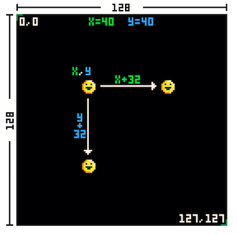
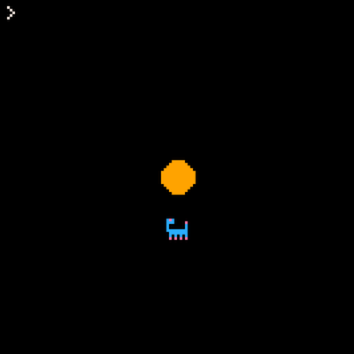
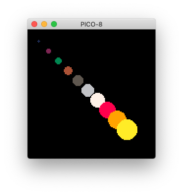
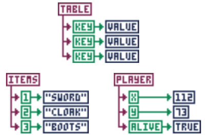
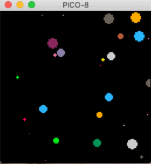

# Day 1

## Overview

Meet+greet, learn about PICO-8 and make our first visualization!

## Plan

### Intros

- Teacher and students
    - Name
    - Mention a game you like and why
        - Maybe chosen pico-8 game from application

### PICO-8

#### Virtual console

> A fantasy console is like a regular console, but without the inconvenience of actual hardware. PICO-8 has everything else that makes a console a console: machine specifications and display format, development tools, design culture, distribution platform, community and playership. It is similar to a retro game emulator, but for a machine that never existed. PICO-8's specifications and ecosystem are instead designed from scratch to produce something that has it's own identity and feels real. Instead of physical cartridges, programs made for PICO-8 are distributed on .png images that look like cartridges, complete with labels and a fixed 32k data capacity. \- [lexaloffle.com](https://www.lexaloffle.com/pico-8.php)


> PICO-8 is a fantasy console for making, sharing and playing tiny games and other computer programs. It feels like a regular console, but runs on Windows / Mac / Linux. When you turn it on, the machine greets you with a commandline, a suite of cartridge creation tools, and an online cartridge browser called SPLORE. \- [lexaloffle.com](https://www.lexaloffle.com/pico-8.php)

#### Limitations
- Display: 128x128 16 colours
- Cartridge: Size 32k
- Sound: 4 channel chip blerps
- Code: Lua
- Sprites: 256 8x8 sprites
- Map: 128x32 cels

> The harsh limitations of PICO-8 are carefully chosen to be fun to work with, to encourage small but expressive designs, and to give cartridges made with PICO-8 their own particular look and feel. \- [lexaloffle.com](https://www.lexaloffle.com/pico-8.php)

#### Community

- There is a great community around PICO-8 because it's very easy to share cartridges.
- You can play carts online and locally on your machine by running `SPLORE`

#### Example games

- [Celeste](https://www.lexaloffle.com/bbs/?tid=2145)
    - Was made on the PICO-8 before becoming a very successful game on more 'advanced' platforms
- [Lines](https://www.lexaloffle.com/bbs/?pid=64653#p)
    - People also create visuals

### Dive in!

#### Intro

- "Today we'll make a visualization while learning about PICO-8!"
- Everyone open PICO-8 and share your screen.
  - Ideally you can see my screen and your pico-8 side by side

####  Navigation
- Commands
    - `HELP`, `LS`, `CD`, `MKDIR`
    - `INSTALL_DEMOS`
        - Play a game locally!
        - `LOAD JEPLI` + `RUN`
- Editor
    - Code, Sprite, Map, Sound, Music

#### Resources

- Download this: [pico_workshop_v1.zip](https://github.com/SourenP/pico_workshop/releases/download/1.0/pico_workshop_v1.zip) (tinyurl.com/y96gzdmc)
- Run `FOLDER` in pico-8 and then copy paste the `code/` folder into the directory that PICO-8 opened.
- You should now see the `CODE` directory in your PICO-8 when you run `LS`
- The folder you just downloaded also has all the lesson plans (in english, sorry) and resources
- Let's check out the resources folder really quickly:
  - Open the [resources/cheatsheet.png](../resources/cheatsheet.png) file for example

### Hello Circle

- We will now make some visualization.
- I will explain the code and then we'll do some exercises.
- Feel free to interrupt me at any point if you get stuck or have any questions
- You don't need to copy any of my code, just focus on understanding what I'm explaining and ask questions!

#### Draw single

- 128x128 coordinate space



- Draw shapes with `circlfill`, `rectfill`, `circ`, `rect`, `line`
- Draw sprites with `spr`

```lua
function _init()
  cls()
  circfill(64,64,6,9)
  spr(1, 60, 80)
end
```

- Run!



- *Exercise! (8m)*
  - Draw a picture using a couple of shapes and a sprite
    - For example: a flower, a face, a house, etc
  - Use the [Cheat Sheet](https://www.lexaloffle.com/bbs/files/16585/PICO-8_Cheat-Sheet_0-9-2.png) for reference
  - Remember to run your code you press `ESC` and then type `RUN`. Pressing `ESC` again will open your code.
  - Base code: [code/exercises/draw_single.p8](code/exercises/draw_single.p8)


#### Draw Loop

```lua
function _draw()
  cls()
  for i=1,10 do
    circfill(i*10,i*10,4,4)
  end
end
```

- How can I make it so that the cirles change color?
  - Hint: `CIRCFILL(x, y, r, c)` (look in [Cheat Sheet](https://www.lexaloffle.com/bbs/files/16585/PICO-8_Cheat-Sheet_0-9-2.png))

- Run!



- *Exercise! (8m)*
  - Can you draw 8 rectangles that gradually grow in size and color?
  - Hint: The `x1, y1` and `x2,y2` are the top left and bottom right points of the rectangle respectively in `RECTFILL(x1, y1, x2, y2, c2)`
  - Base code: [code/exercises/draw_loop.p8](code/exercises/draw_loop.p8)

#### Draw Table
##### Tables as maps

- Tables hold a set of properties



```lua
function _init()
  c = {
    x = 40,
    y = 60,
    r = 10,
    c = 9,
    kapik=24
  }
end

function _draw()
   cls()
   circfill(c.x,c.y,c.r,c.c)
end
```

- Copy and run!


- *Exercise! (8m)*
  - Can you make a table that describes a square and draw rectfill() using its properties?
  - Hint: Use the properties `x`, `y`, `size`, `color`
  - Base code: [code/exercises/draw_map.p8](code/exercises/draw_map.p8)

##### Tables as arrays
```lua
function _init()
  c1 = {
    x = 40,
    y = 60,
    r = 10,
    c = 9,
    kapik=24
  }

  c2 = {
    x = 50,
    y = 80,
    r = 10,
    c = 6
  }

  circles = {c1, c2}
  -- or
  -- add(cirlces,c1)
  -- add(circles, c2)
end

function _draw()
    cls()
    for c in all(circles) do
    circfill(c.x,c.y,c.r,c.c)
    end
end
```

- Copy and run!


- *Exercise! (8m)*
  - Can you make a table that describes a square and draw rectfill() using its properties?
  - Hint: Use the properties `x`, `y`, `size`, `color`
  - Base code: [code/exercises/draw_array.p8](code/exercises/draw_array.p8)

#### Draw Update
`_update`, `rnd`, `flr`
```lua
function _init()
-- cls()
  circle = {
    x = 64,
    y = 64,
    r = 4,
    c = 6
  }
end

function _update()
    circle.x = flr(rnd(128))
    circle.y = flr(rnd(128))
    circle.c = flr(rnd(16))
    circle.r = flr(rnd(5))
end

function _draw()
    circfill(
    circle.x,
    circle.y,
    circle.r,
    circle.c
    )
end
```
- Run!



- *Exercise! (8m)*
  - How can you modify this visual to make it more interesting?
  - Feel free to ask questions as you work
  - Share your results!
  - Base code: [code/exercises/circles.p8](code/exercises/circles.p8)


#### Commands
- `SAVE`
- `LOAD`
- `RUN`

#### Code from today

- [circles.p8](code/circles.p8)


### Homework
- Draw a pretty picture using
    - `_init`
    - `_update`
    - `_draw`
    - tables
    - shapes
- Use resources
- Play with the PICO-8 demos!

### Bye bye

- Bye bye
