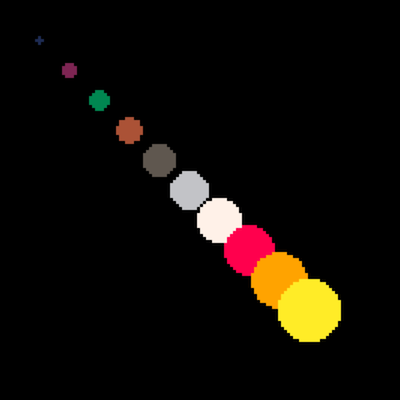
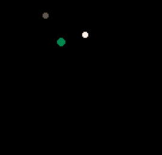

# Day 1

## Overview

Meet+greet, learn about PICO-8 and make our first visualization!

## Plan

### Intros

- Teacher and students
    - Name
    - Mention a game you like and why
        - Maybe chosen pico-8 game from application

### PICO-8

- Talk about PICO-8
    - Virtual console
    - Limitations
    - Community
- Showcase games
    - TODO
- Showcase visuals
    - TODO

### Dive in!

- Intro
  - "Today we'll make a visualization while learning about PICO-8!"
- Navigation
	- Everyone open PICO-8 and share your screen
	- Commands
	    - LS, CD, MKDIR, HELP, CLS
	    - Splore
	- Editor
	    - Code, Sprite, Map, Sound, Music
    - Cheat sheets!
      - [PICO-8 Cheat Sheet](https://www.lexaloffle.com/bbs/files/16585/PICO-8_Cheat-Sheet_0-9-2.png)

### Hello Circle

- We will now make some visualization.
- Everyone should copy the code we are writing and make sure they get the same result as me.
- Feel free to interrupt me at any point if you get stuck or have any questions

#### Draw single
shapes `circlfill`, sprites `spr`, sounds `sfx`
```lua
function _draw()
  cls()
  circfill(64,64,6,9)
  spr(1, 60, 80)
  sfx(0)
end
```

#### Draw Loop
for loops `for i=1,10 do`
```lua
function _draw()
  cls()
  for i=1,10 do
    circfill(i*10,i*10,i,i)
  end
end
```


#### Draw Table
tables as maps `{}`
```lua
function _init()
    c = {
    x = 40,
    y = 60,
    r = 10,
    c = 9,
    kapik=24
    }
end

function _draw()
    cls()
    circfill(c.x,c.y,c.r,c.c)
end
```


tables as arrays `{}`
```lua
function _init()
    c1 = {
    x = 40,
    y = 60,
    r = 10,
    c = 9,
    kapik=24
    }

    c2 = {
    x = 50,
    y = 80,
    r = 10,
    c = 6
    }

    circles = {c1, c2}
    -- or add(cirlces,c1)
end

function _draw()
    cls()
    for c in all(circles) do
    circfill(c.x,c.y,c.r,c.c)
    end
end
```


#### Draw Update
`_update`, `rnd`, `flr`
```lua
function _init()
-- cls()
  circle = {
    x = 64,
    y = 64,
    r = 4,
    c = 6
  }
end

function _update()
    circle.x = flr(rnd(128))
    circle.y = flr(rnd(128))
    circle.c = flr(rnd(16))
    circle.r = flr(rnd(5))
end

function _draw()
    circfill(
    circle.x,
    circle.y,
    circle.r,
    circle.c
    )
end
```


#### Code from today

- [circles](code/circles.p8)

#### Commands
- `SAVE`
- `LOAD`
- `RUN`

### Homework
- Draw a pretty picture using
    - `_init`
    - `_update`
    - `_draw`
    - tables
    - shapes

- Use resources
    - [PICO-8 Resources](https://github.com/SourenP/pico_workshop#resources)
      - [Cheat Sheet](https://www.lexaloffle.com/bbs/files/16585/PICO-8_Cheat-Sheet_0-9-2.png)
    - [Workshop repo](https://github.com/SourenP/pico_workshop)
      - [This lesson plan](https://github.com/SourenP/pico_workshop/blob/master/lesson_plan/day_1.md)

### Bye bye

- Reminder of names :)
- Bye bye