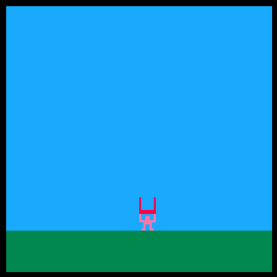

# Day 2

## Overview

Make our first game!

## Plan

### Hello

- How is everyone doing?
- Reminder of names :)

### Share homework

- Take turns sharing what we made!
    - Did we get stuck?
    - Any questions?

### First game

#### Intro

- Now that we know how to draw, if we add interactivity - we'll have our first game!
- We're going to make a game where you collect dropping fruit


#### Fruit Drop

- Follow slightly modified version fruit drop tutorial
    - [nerdyteachers:: FruitDrop Tutorial](https://nerdyteachers.com/Explain/FruitDrop/)
    - _Disclaimer: I didn't make this tutorial. It was made by [nerdyteachers](nerdyteachers.com) and all credit goes to them!_

##### Setup variables

- Sprite numbers
- Player position

```lua
basket_sprite=1
player_sprite=2
fruit_sprite=3

player_x=64
player_y=100
```

#### Draw sprites

- Go into the sprite editor and make the sprites
    - [01] Basket
    - [02] Player
    - [03] Fruit


#### More variables

```lua
fruits={}
fruit_interval=16
fruit_count=4

gravity=1
points=0
```

#### Game loop

- Most games have this loop
    - init: setup game
    - update: make changes
        - 30/sec in pico-8
    - draw: draw new frame
        - 30/sec in pico-8

```lua
function _init()

end

function _update()

end

function _draw()

end
```

#### Draw Player, Basket, Ground

```lua
function _draw()
  cls(12)
  rectfill(0,108,127,127,3)
  spr(player_sprite,player_x,player_y)
  spr(basket_sprite,player_x,player_y-8)
end
```

- Run game!
    - Should see player, basket and floor


#### Player controls

##### Player move
- Introduce if statement

```lua
function _update()
  if btn(0) then
    player_x-=2
  end
  if btn(1) then
    player_x+=2
  end
end
```

- Run game!
    - Should be able to move player


##### Screen borders

- *Exercise! (10m)*
    - How would you make the player not leave the screen?
    - Base code: [code/excercises/fruit_player.p8](code/exercises/fruit_player.p8)
      - Modify the code under the comment `--player move` in `_update()`


```lua
function _update()
  -- player move
  if btn(0) then
    if player_x > 0 then
      player_x-=2
    end
  end

  if btn(1) then
    if player_x < 128 then
      player_x+=2
    end
  end
end
```

- Run game!
    - Player shouldn't be able to leave screen on the left
    - Why is the player going off screen on the right?

- Modification
    - Let's keep all of the player on screen.
    - Let's use `and` in `if` statement

```lua
function _update()
  if btn(0) and player_x >= 2 then
      player_x-=2
  end

  if btn(1) and player_x <= (128-8-2) then
      player_x+=2
  end
end
```

- Run game!
    - Player shouldn't be able to lave screen on both sides



#### Create the fruit

- Let's create fruit above the screen to drop down

```lua
function _init()
  for i=1,fruit_count do
    fruit={
      sprite=fruit_sprite,
      x=flr(rnd(120)),
      y=-fruit_interval*i
    }
    add(fruits, fruit)
  end
end
```

#### Update the fruit

- Let's move and draw the fruit that we created
    - We will use the `all` keyword to loop through fruits

```lua
function _update()
  -- ...
  for fruit in all(fruits) do
    fruit.y+=gravity
  end
end

function _draw()
  -- ...
  for fruit in all(fruits) do
    spr(fruit.sprite,fruit.x,fruit.y)
  end
end
```

- Run game!
    - Should see 4 fruit fall


#### Catch fruit

```lua
function _update()
  for fruit in all(fruits) do
    fruit.y+=gravity
    if fruit.y+4>=player_y-8 and
       fruit.y+4<=player_y and
       fruit.x+4>=player_x and
       fruit.x+4<=player_x+8 then
      points+=1
      del(fruits,fruit)
    end
  end
end

```

- Run game!
    - Should be able to catch falling fruit


#### Score points and delete fruit that hit floor

- *Exercise! (8m)*
    - How would you make the fruit disappear when it hits the floor?
    - Base code: [code/exercises/fruit_floor.p8](code/exercises/fruit_floor.p8)
      - Write code under comment `--fruit delete` in `_update()`

```lua
function _update()
  for fruit in all(fruits) do
    -- ...

    -- floor delete
    if fruit.y>100 then
        del(fruits,fruit)
    end
  end
end

function _draw()
  -- ...
  print("score= "..points)
end
```

- Run game!
  - Should see score
  - Fruits should disappear when they hit floor


#### Add sound effect for fruit catch and floor hit

```lua
-- ...
del(fruits, fruit)
sfx(0)

-- ..
del(fruits, fruit)
sfx(1)
```

- Run game!
  - Should hear sound effects

#### Code from today

[fruit_drop.p8](code/fruit_drop.p8)


### Homework
- Change the fruit drop game into your own creation!
    - Some ideas:
        - Make rounds of falling fruit
        - Add different kinds of fruit each with different score
        - Add a poison fruit that makes you lose if you catch it
        - Add a capacity to that basket that you need to empty somewhere
        - Draw more sprites and make more sound effects / music
        - Make the basket fill up when you catch fruit
        - Come up with your own ideas!

- Use resources
    - [nerdyteachers:: FruitDrop Tutorial](https://nerdyteachers.com/Explain/FruitDrop/)

### Bye bye

- Bye bye
