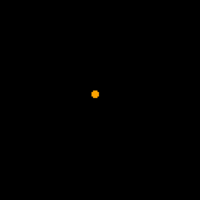
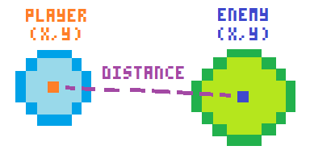

# Day 3

## Overview

Make our second game!

## Plan

### Hello

- How is everyone doing?

### Share homework

- Take turns sharing what we made!
    - Did we get stuck?
    - Any questions?

### Second game

#### Intro

- Let's try to make a slightly more complicated game


#### Cells

- Follow slightly modified version of cells tutorial
    - [nerdyteachers:: Cells Tutorial](https://nerdyteachers.com/Explain/Cells/)
    - _Disclaimer: I didn't make this tutorial. It was made by [nerdyteachers](nerdyteachers.com) and all credit goes to them!_

#### Setup

- We're going to initialize these:
  - Player table
  - Game settings

```lua
--init
function _init()
  --player table
  ...

  --game settings
  ...
end
```

##### Player table
```lua
  --player table
  player={
    x = 60,
    y = 60,
    c = 9,
    r = 2,
    speed = 1.5,
  }
```

##### Game settings
```lua
  --game settings
  enemies = {}
  max_enemies = 12
  max_enemy_size = 6
  enemy_speed = 0.6
  points = 0
```

#### Player

##### Draw player

- *Exercise! (6m)*
  - How would you draw the player using the `player` table
  - Base code: [code/exercises/cell_draw.p8](code/exercises/cell_draw.p8)
    - Write code under comment `--player` in `_draw()`

```lua
--draw
function _draw()
  cls()

  --player
  circfill(player.x,player.y,player.r,player.c)
  circ(player.x,player.y,player.r+1,player.c+1)
end
```

##### Move player

- *Exercise! (6m)*
  - How would we get the player to move using the `player` table
  - Hint: we have `player.x` `player.y` `player.speed` `btn(0) btn(1) btn(2) btn(3)`
  - Base code: [code/exercises/cell_move.p8](code/exercises/cell_move.p8)
    - Write code under comment `--player movement` in `_update()`

```lua
function _update()
  --player movement
  if btn(0) then player.x -= player.speed end
  if btn(1) then player.x += player.speed end
  if btn(2) then player.y -= player.speed end
  if btn(3) then player.y += player.speed end

  --flip sides
  if player.x > 127 then player.x = 1 end
  if player.x < 0 then player.x = 126 end
  if player.y > 127 then player.y = 1 end
  if player.y < 0 then player.y = 126 end
end
```

- Run game!
    - Should be able to move around player circle
    - [code/partial/cell_player.p8](code/partial/cell_player.p8)


#### Enemies

- We are going to have circles of many sizes and colors move through the screen in all directions.

- We need to:
  - Decide how many enemies to we need to create based on how many are currently present
  - Choose a random screen side to create them at
  - Move the enemy in its direction


##### Create enemies

- We will write the create code in its own function

```lua
function _update()
  -- ..

  -- create enemies
  create_enemies()
end

function create_enemies()
  if #enemies < max_enemies then
  --make enemy table
    local enemy = {
      x = 0,
      y = 0,
      speed_x = enemy_speed,
      speed_y = enemy_speed,
      r = flr(rnd(max_enemy_size))+1,
      c = flr(rnd(15))+1
    }

    --random start position and speed
    place = flr(rnd(4))
    if place == 0 then
      --left
      enemy.x = -8
      enemy.y = flr(rnd(128))
      enemy.speed_x = enemy.speed_x
      enemy.speed_y = 0
    elseif place==1 then
      --right
      enemy.x = 128+8
      enemy.y = flr(rnd(128))
      enemy.speed_x = -enemy.speed_x
      enemy.speed_y = 0
    elseif place==2 then
      --top
      enemy.x = flr(rnd(128))
      enemy.y = -8
      enemy.speed_x = 0
      enemy.speed_y = enemy.speed_y
    elseif place==3 then
      --bottom
      enemy.x = flr(rnd(128))
      enemy.y = 128+8
      enemy.speed_x = 0
      enemy.speed_y = -enemy.speed_y
    end

    --add it to enemies table
    add(enemies,enemy)
  end
end
```

- We won't be able to see the enemies yet because they spawn outside the screen but if we move and draw them then we'll be able to!

##### Move and draw enemies

- *Exercise! (8m)*
  - How do we make the enemies move?
  - Base code: [code/exercises/cell_enemy.p8](code/exercises/cell_enemy.p8)
    - Write code under comment `-- move enemies` in `_update()`

```lua
function _update()
  -- ..

  -- create enemies
  create_enemies()

  -- move enemies
  for enemy in all(enemies) do
    enemy.x += enemy.speed_x
    enemy.y += enemy.speed_y
  end
end
```

Draw enemies:

```lua
--draw
function _draw()
  -- ..

  -- enemies
  for enemy in all(enemies) do
    circ(enemy.x,enemy.y,enemy.r,enemy.c)
  end
end
```

- Run game!
    - Enemies should move in from all directions



#### Improve enemy creation

- Enemies are being created on the same line on each side. It would be nicer if they moved in at different times and speeds.

- *Exercise! (10m)*
  - How would you do this?
  - No need to write code, discuss verbally and write together

- A way to solve this is to
  - scale their speed by a random number
    - `local speed = flr(rnd(3)) * enemy_speed`
  - create them at different distances from the side of the screen
    - `enemy.x/y = +-8 +- flr(rnd(16))`
```lua
function create_enemies()
  -- ...

    -- make enemy table
    local speed = flr(rnd(2) + 1) * enemy_speed
    local enemy = {
      x = 0,
      y = 0,
      speed_x = speed,
      speed_y = speed,
      r = flr(rnd(max_enemy_size))+1,
      c = flr(rnd(15))+1
    }

    --random start position
    place = flr(rnd(4))
    if place == 0 then
      --left
      enemy.x = -8 - flr(rnd(16))
      -- ...
    elseif place==1 then
      --right
      enemy.x = 8 + flr(rnd(16))
      -- ...
    elseif place==2 then
      --top
      enemy.x = flr(rnd(128))
      enemy.y = -8 - flr(rnd(16))
      -- ...
    elseif place==3 then
      --bottom
      enemy.y = 128+8 + flr(rnd(16))
      -- ...
    end
```

- Run game!
    - Enemies should move in random offsets and speeds from all directions
    - [code/partial/cell_spawn.p8](code/partial/cell_spawn.p8)


##### Delete enemies

- We only have one wave of enemies. When an enemy leaves the screen they keep going forever.


- *Exercise! (8m)*
  - We should delete an enemy when it leaves the screen so that a new enemy spawns in its place.
  - We can also give the player a point when an enemy leaves.
  - Base code: [code/exercises/cell_delete.p8](code/exercises/cell_delete.p8)
    - Write code under comment `-- delete enemies` in `_update()`

Delete enemy and give point:
```lua
function _update()
  --player controls
  -- ...

  -- flip sides
  -- ...

  -- create enemies
  -- ...

  -- move enemies
  for enemy in all(enemies) do
    enemy.x += enemy.speed_x
    enemy.y += enemy.speed_y

    -- delete enemies
    if enemy.x > (128+25)
    or enemy.x < -25
    or enemy.y < -25
    or enemy.y > (128+25) then
      del(enemies,enemy)
      points += 1
    end
  end
end

function _draw()
  -- ...

  --score
  print("score= "..points)
end
```

- Run game!
    - Enemies should respawn and player should score points
    - [code/partial/cell_points.p8](code/partial/cell_points.p8)


##### Collision Function

- We now have to detect when an enemy circle collides with a player
- To check if two circles are colliding you have to compart the distance between their centers with the sum of their radii





- Don't worry too much if the math is hard to understand, you can use this function without perfectly understanding how it works

```lua
--collision

function circ_collide(x1,y1,r1,x2,y2,r2)

    dist = sqrt((x1-x2) * (x1-x2) + (y1-y2) * (y1-y2))

    rsum = (r1+r2)

    if dist == rsum then
        --circles touch
        return false
    elseif dist>rsum then
        --circles not touch
        return false
    else
        --circles overlap
        return true
    end
end
```

##### Collision handling

- Now that we can detect collision, let's make it so that the player's score resets to zero when they hit a circle

- *Exercise! (6m)*
  - How would you do this?
  - Base code: [code/exercises/cell_collide.p8](code/exercises/cell_collide.p8)
    - Write code under comment `-- enemy player collision` in `_update()`

```lua
function _update()
  -- ...

  for enemy in all(enemies) do
    -- ...

    -- enemy player collision
    if circ_collide(
      player.x,player.y,player.r,
      enemy.x,enemy.y,enemy.r
    ) then
      points = 0
    end
  end
end
```

- Run game!
    - Score should reset on player-enemy collision
    - [cell.p8](code/cell.p8)

#### Code from today

[code/cell.p8](code/cell.p8)


### Homework
- Start working on your own game!
    - Fruit drop and cell were intentionally not complete games
    - Pick either fruit drop or cell and try to make your own out of it using the code as a base!

- Use resources
    - todo

### Bye bye

- Bye bye
